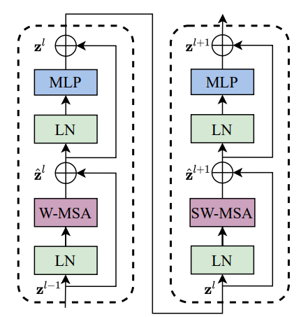
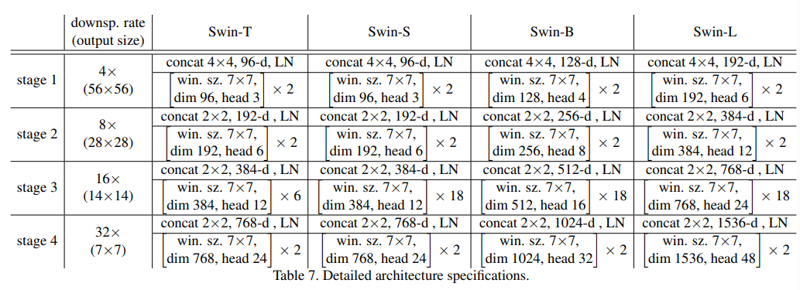

# Swin Transformer: Hierarchical Vision Transformer using Shifted Windows

| Vision                      | Language                  | Difficulty                                                   |
| --------------------------- | ------------------------- | ------------------------------------------------------------ |
| vary substantially in scale | word token                | fixed scale in NLP while vary in CV                          |
| resolution of pixels        | words in passages of text | computational complexity of its self-attention is quadratic to image size |

Swin Transformer, which capably serves as a general-purpose backbone for computer vision. It is basically a hierarchical Transformer whose representation is computed with shifted windows. The shifted windowing scheme brings greater efficiency by limiting self-attention computation to non-overlapping local windows while also allowing for cross-window connection.

##  Overall Architecture

- first splits an input RGB image into non-overlapping patches by a patch splitting module

  - use a patch size of 4 × 4 and thus the feature dimension of each patch is 4 × 4 × 3 = 48

- Stage 1

  - A linear embedding layer is applied on this raw-valued feature to project it to an arbitrary dimension (denoted as C)
  - Several Transformer blocks with modified self-attention computation (Swin Transformer blocks) are applied on these patch tokens

- Stage 2, 3 &4

  -  To produce a hierarchical representation, the number of tokens is reduced by patch merging layers 
  -  first patch merging layer concatenates the features of each group of 2 × 2 neighboring patches
    - applies a linear layer on the 4C-dimensional concatenated features. 
    - This reduces the number of tokens by a multiple of 2×2 = 4 (2× downsampling of resolution), and the output dimension is set to 2C.
  - Swin Transformer blocks are applied afterwards for feature transformation

  

### Swin Transformer block

Swin Transformer is built by replacing the standard multi-head self attention (MSA) module in a Transformer block by a module based on shifted windows, with other layers kept the same. 

- A Swin Transformer block consists of a shifted window based MSA module, followed by a 2-layer MLP with GELU nonlinearity in between. 
- A LayerNorm (LN) layer is applied before each MSA module and each MLP, and a residual connection is applied after each module.

### Shifted Window based Self-Attention

The window-based self-attention module lacks connections across windows, which limits its modeling power.

#### Relative position bias

In computing self-attention, we include a relative position bias $B ∈ R^{M^2×M^2}$ to each head in computing similarity:
$$
Attention(Q,K,V)=softmax(\frac{QK^T}{\sqrt{d}}+B)V
$$

where $Q,K,V \in \real^{M^2\times d}$ are the $query, key \ and \ value$ matrices

#### detailed architecture specifications

default Architecture Variants:

- window size is set to $M=7$
- query dimension of each head is $d=32$
- the expansion layer of each MLP is $α = 4$

take **Swin-T** as example:

- origin input size is:[224, 224, 3]
- after patch splitting ($\frac{224}{4}=56$) and linear embedding layer:[56, 56, 96]
- 3 head with dimension of 32 result in $32 \times 3=96$ channels
